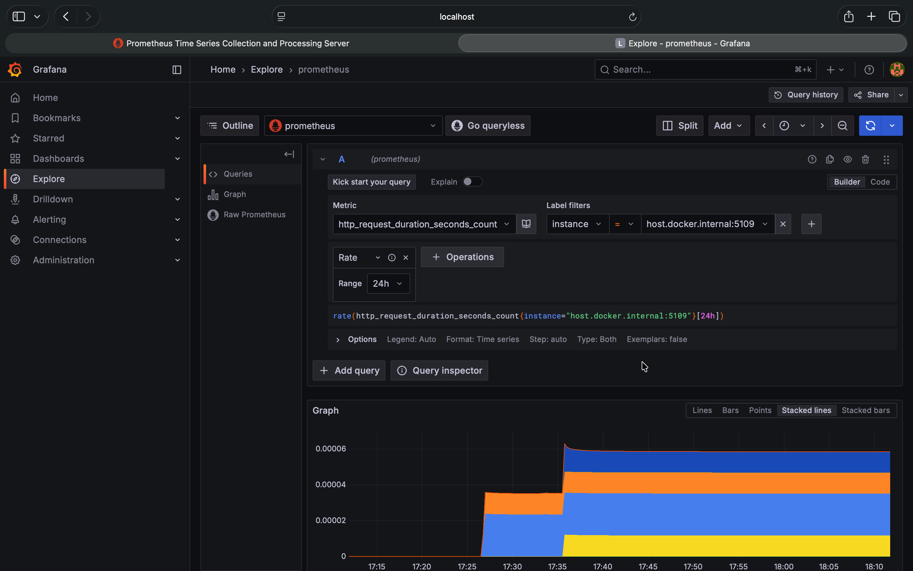

# 🚀 SolidShortener — A Clean Architecture URL Shortener API

A **production-grade, extensible URL Shortener** built using **.NET 8**, designed with **Clean Architecture principles**, **CQRS**, and **SOLID design patterns**.  
This project demonstrates how to structure modern backend applications with clear separation of concerns, maintainability, and scalability in mind.

---

## 🧠 Overview

`SolidShortener` is a backend service that:

- Allows users to **register and log in** securely with JWT authentication.  
- Lets authenticated users **shorten URLs** and manage them (CRUD).  
- Tracks **visits** for each shortened link.  
- Implements **caching with Redis** for performance and scalability.  
- Includes **rate limiting** and **global error handling** middleware for robustness.  

This is a **fully layered, modular architecture** following **Clean Architecture + CQRS**.

---

## 🏗️ Architecture

Project structure:

```
src/
 ├── SolidShortener.Domain/          → Core entities, aggregates, and domain logic
 ├── SolidShortener.Application/     → Use cases, DTOs, interfaces, and business rules
 ├── SolidShortener.Infrastructure/  → EF Core, Redis, external services, persistence
 └── SolidShortener.Api/             → Presentation layer (controllers, filters, middleware)
```

---

### **1️⃣ Domain Layer (Core)**

Contains the core business logic and entities:
- `User`, `Url`, and `Visit` entities.  
- Domain behaviors like `IncrementVisitsCount()`, `MarkAsDeleted()`, etc.  
- No dependencies on external frameworks.

🧩 **Purpose:**  
Keeps the business logic pure and independent of infrastructure or frameworks.

---

### **2️⃣ Application Layer**

Implements **use cases**, **DTOs**, and **interfaces** defining how the system behaves:
- Commands and Queries for **CQRS** (e.g., `ShortenUrlCommand`, `GetUrlsByUserQuery`).  
- Service contracts like `IUserService`, `IUrlService`, `IVisitService`.  
- Repository interfaces to be implemented by Infrastructure.

🧩 **Purpose:**  
Contains business rules — defines *what* should happen, not *how*.

---

### **3️⃣ Infrastructure Layer**

Handles external concerns and integrations:
- **Persistence:** EF Core with PostgreSQL  
- **Caching:** Redis via decorator pattern (`CachedUrlRepository`)  
- **Authentication:** JWT generation  
- **Security:** BCrypt password hashing  
- **Dependency injection:** Centralized in `DependencyInjection.cs`

🧩 **Purpose:**  
Implements the contracts from the Application layer — fully replaceable and framework-aware.

---

### **4️⃣ Presentation Layer (API)**

The ASP.NET Core Web API — entry point of the system.

Includes:
- **Controllers:**  
  - `UserController` — registration and login  
  - `UrlController` — shorten, retrieve, and delete URLs  
  - `VisitController` — visit tracking and analytics  
- **Middlewares:**  
  - Global error handling  
  - Rate limiting  
  - Model validation filter  
- **Swagger/OpenAPI** for interactive API docs.

🧩 **Purpose:**  
Handles HTTP concerns and delegates logic to the Application layer.

---

## ⚙️ Key Features

| Feature | Description |
|----------|-------------|
| 🧩 **Clean Architecture** | Decoupled layers ensuring maintainability and scalability |
| ⚙️ **CQRS Pattern** | Commands for writes, Queries for reads |
| 🛡 **JWT Authentication** | Secure stateless login |
| 💾 **Redis Caching** | Fast data retrieval with repository decorator |
| 🧱 **PostgreSQL + EF Core** | ORM and migrations for persistence |
| 🚦 **Rate Limiting** | Protects endpoints from abuse |
| ⚡ **Global Error Handling** | Centralized, consistent responses |
| 🔐 **BCrypt Password Hashing** | Secure password management |
| 🧩 **Extensible DI Setup** | Easy to swap out implementations |

---

## 🧰 Tech Stack

- .NET 8  
- Entity Framework Core  
- PostgreSQL  
- Redis  
- JWT Authentication  
- BCrypt  
- Swagger / OpenAPI  

---

## 🧭 Flow Example

1. A registered user logs in → receives a JWT token.  
2. Sends a `POST /api/url/shorten` request with a long URL.  
3. Application generates a short code via **Base62** using URL ID.  
4. Redis caches URLs for faster lookups.  
5. Visits are logged and counted per short code.

---

## 🪄 Middlewares

| Middleware | Responsibility |
|-------------|----------------|
| **ErrorHandlingMiddleware** | Converts exceptions into structured HTTP responses |
| **RateLimitingMiddleware** | Limits requests per IP or user within a time window |
| **ValidationFilter** | Ensures clean and validated incoming requests |

---

## 🧩 Caching Strategy

Implements a **decorator pattern** on `IUrlRepository`:

```csharp
services.AddScoped<IUrlRepository, UrlRepository>();
services.Decorate<IUrlRepository, CachedUrlRepository>();
```

- Reads from Redis before hitting the DB.  
- Writes/updates invalidate cache entries automatically.

---

## 🧱 Example Endpoints

| Method | Endpoint | Description | Auth |
|--------|-----------|--------------|------|
| `POST` | `/api/users/register` | Register a new user | ❌ |
| `POST` | `/api/users/login` | Authenticate user and return JWT | ❌ |
| `POST` | `/api/url/shorten` | Shorten a URL | ✅ |
| `GET` | `/api/url/{code}` | Redirect to original URL | ❌ |
| `GET` | `/api/url` | Get all URLs by user | ✅ |
| `DELETE` | `/api/url/{code}` | Delete a shortened URL | ✅ |
| `GET` | `/api/visit/count/{shortCode}` | Get visit count | ✅ |
| `GET` | `/api/visit/visits/{shortCode}` | Get all visit records | ✅ |

---

## 🧩 Design Highlights

- **Idempotent URL creation:** Reuses existing URLs instead of duplicating.  
- **Base62 encoding:** Generates collision-free shortcodes from numeric IDs.  
- **Middleware-driven resilience:** Centralized rate limiting and error handling.  
- **Dependency inversion:** Core layers depend only on abstractions.  
- **Swappable infrastructure:** Change DB, cache, or auth without breaking logic.

---

## 🧩 Observability (Prometheus + Grafana Integration)

This project includes real-time performance and request metrics powered by **Prometheus** and visualized in **Grafana**.

Key metrics tracked:
- HTTP request duration and status codes
- Endpoint-level throughput
- Application latency and performance trends

#### 📊 Example Dashboard

<p align="center">
  
  
</p>

---


## 🧠 Key Takeaway

`SolidShortener` isn’t just a URL shortener — it’s a blueprint for building **maintainable, scalable, and enterprise-grade APIs** using .NET 8, Clean Architecture, and CQRS.

---

## 📁 Repository Structure (Simplified)

```
src/
 ├── SolidShortener.Domain/
 │    ├── Entities/
 │    └── BaseEntity.cs
 │
 ├── SolidShortener.Application/
 │    ├── Users/
 │    ├── Urls/
 │    ├── Visits/
 │    ├── Interfaces/
 │    └── DTOs/
 │
 ├── SolidShortener.Infrastructure/
 │    ├── Persistence/
 │    ├── Repositories/
 │    ├── Configurations/
 │    └── Services/
 │
 └── SolidShortener.Api/
      ├── Controllers/
      ├── Middleware/
      ├── Filters/
      └── Services/
```

---

## 🧩 Author

**Syed Hassan**  
